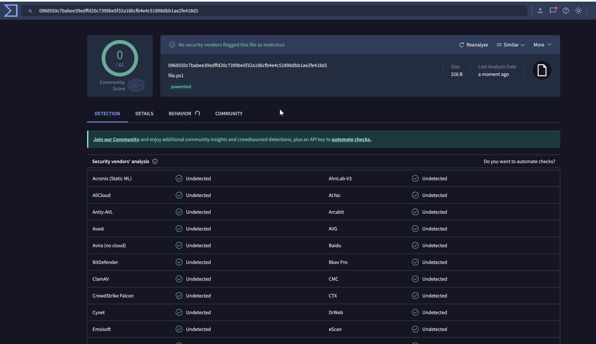
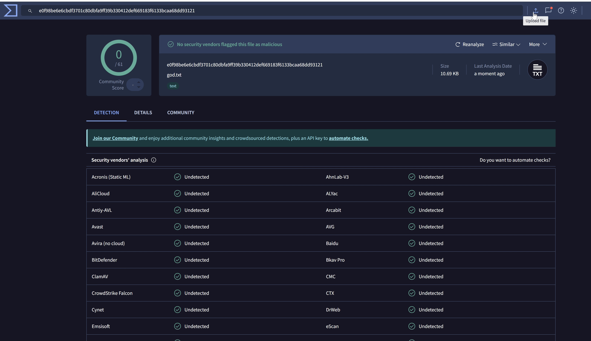
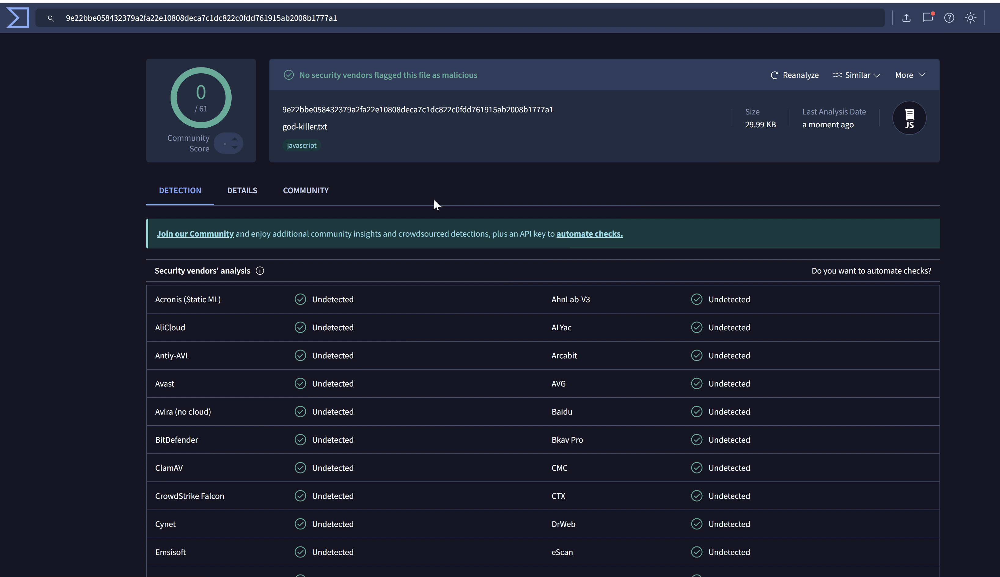

# Narashima - The Stealth God of Payload Delivery

> Advanced PowerShell payload obfuscation and evasion framework for red teamers.

---

## ⚔️ Overview

**Narashima** is a red team payload generation tool built to **evade antivirus**, **bypass AMSI**, and **slip past Microsoft Defender** using multi-stage, obfuscated, and encrypted PowerShell payloads. With layered XOR + Base64 encoding and clean staging, it delivers fully memory-resident payloads with zero detections.

---

## 🔥 Key Features

- 🛡️ AMSI & Defender Bypass, AV Bypass with 0 Detection rate  
- 🔐 XOR + Base64 Multi-Stage Encryption  
- 🧬 Function and Variable Name and backticks and lot of Obfuscation  
- 📦 Multi-layer Payload Staging  
- 🔑 Custom XOR Key Encryption   
- Function Mapping
---


## Virustotal Results





## 🚀 Usage

### Attacker side

- Modify any Powershell script inside shell/* and change the IP and Port for reverse shell

```bash

pip3 install -r requirements.txt (recommended above or equal to python 3.12.x)

chmod +x narashima

./narashima -o /tmp/rev.ps1 -s -d -n -x -i -f -b --decimal -l 2 --random-backticks  --key "<your-secret-key>" /shell/Invoke-PowerShellTcp.ps1
```
- open the listening port on your machine

```bash
nc -lvnp <port>
```


### Victim side

- Now the exe will give three files (file.ps1, god.txt, god-killer.txt)
- Place all three files on the victim machine and run file.ps1

```powershell
powershell -ep bypass ./file.ps1
```

### 🧩 Available Options

- `target` – Your raw PowerShell payload  
- `-o, --output` – Output path for the final obfuscated/encrypted payload  
- `--key` – XOR encryption key (default: NarashimaKey)  
- `-l, --level` – String obfuscation level (0 = Random, 1–5 = Increasing intensity)  
- `-s, --strings` – Enable string obfuscation  
- `-d, --data-types` – Obfuscate common PowerShell data types (arrays, booleans, etc.)  
- `-n, --nishang` – Obfuscate known patterns in Nishang payloads  
- `-c, --comments` – Inject misleading/random comments  
- `-x, --hex-ip` – Convert IP addresses into hexadecimal format  
- `-i, --random-spaces` – Randomize indentation and whitespace  
- `-f, --functions` – Obfuscate function names and structures  
- `-b, --use-backticks` – Use PowerShell backticks for breaking strings  
- `--decimal` – Encode final payload as decimal values  
- `-j` – Obfuscate True or False variables  
- `--random-backticks` – Enable random backticks
- `--randomization-type` – {r,d,h} Type of randomization (r: Random, d: Dictionary, h: Hybrid)
- `-F` - Function Mapping (for understanding the obfuscated functions)

---
## Important notification

For now, I have shared the payload, which will be working fine under the /shell directory (This is Narashima version-1 and still under development)


---
## 🛡 Why a Compiled Binary?

Shipping Narashima as an executable helps protect the underlying techniques from reverse engineering, signature creation, and sandbox analysis.
Even if your payload is fully obfuscated and encrypted, making the source code publicly available allows defenders to:

- Understand your obfuscation and encryption logic
- Create detection signatures or YARA rules
- Upload samples to VirusTotal and reverse the pattern

This allows red teamers to safely use zero-detection payloads without exposing the tool’s inner workings to defenders. This adds an additional layer of protection, making reverse engineering and static analysis much harder.

---

## 🧠 Execution Flow

1. **file.ps1**   
   - Base64-decodes `god.txt`

2. **god.txt**  
   - Decrypt with secret key and decodes the content of `god-killer.txt`  
   - Executes it using `Invoke-Expression`

3. **god-killer.txt**  
   - Final payload: encrypted, base64-encoded, obfuscated  

```
cmd.ps1 
   ↓
file.ps1 
   ↓
god.txt ( obfuscated + Base64 encoded script) 
   ↓
god-killer.txt (obfuscation + Encrypted + Base64 ) 
   ↓
Reverse Shell
```

---

## 🎯 Real-World Use

✔️ Tested against:

- Windows 10 / 11 with **Defender enabled**  
- AMSI-enabled environments  

With proper payloads and staging, **zero detections** on upload scanners like VirusTotal.

---

## 🛡️ Evasion Stack

- ✅ AMSI bypass  
- ✅ Defender real-time protection evasion  
- ✅ PowerShell command obfuscation  
- ✅ Function and variable renaming  
- ✅ Memory-only execution  
- ✅ XOR + Base64 dual encoding  
- ✅ Multi-layer loader chain  

---
## 🔐 Multi-Layered Payload Hardening
Obfuscation: All PowerShell payloads are dynamically obfuscated at generation time. Variable names, strings, and execution flow are randomized on each build.

- Encryption: Payloads are encrypted using AES with a unique key per session. The key is never hardcoded — it's delivered at runtime through a separate channel or decryptor stub.
- Base64 Encoding: The final stage payload is base64 encoded for safe transport and execution, making static analysis even harder.

## 🧬 Why This Matters
Even if a SOC team or blue team captures the payload and drops it into a sandbox:

- They won’t be able to decrypt it without the key.
- Execution will fail silently or break flow due to encryption dependencies.
- Static or behavioural analysis becomes ineffective without prior knowledge of the payload structure and key delivery logic.

----
## ⚠️ Disclaimer

This tool is intended **solely for educational use** and **authorized red team assessments**.  
Any **unauthorized usage** against systems you do not own or have permission to test is **strictly forbidden** and may be illegal.

---

## 🙏 Credits

Built with ❤️ for offensive security researchers for the red teaming and infosec community.

Inspired by Narasimha, the fierce and powerful protector in mythology — half-lion, half-man, full destruction.

Special thanks to the following legends whose work inspired the creation of Narashima:
- @klezVirus for Chameleon — a brilliant resource in payload obfuscation and evasion.
- @tokyoneon for Chimera — a solid foundation for offensive tradecraft and creative payload delivery.

```
Respect to the community. This project stands on the shoulders of giants.
```
---

## 📎 License

MIT License. See the `LICENSE` file for full details.
